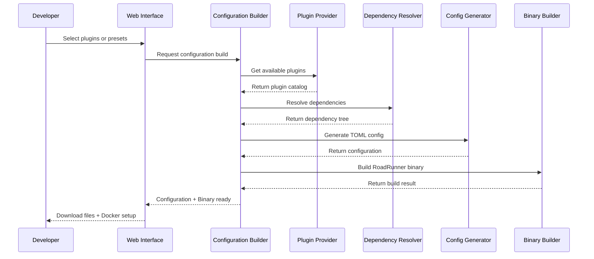
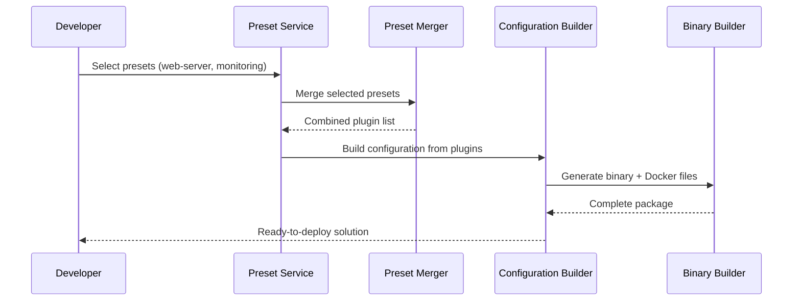
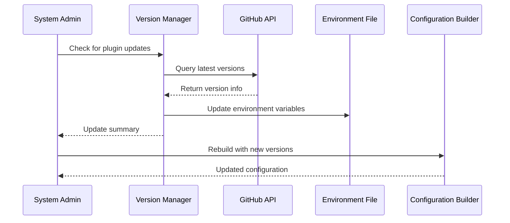

# Velox Configuration Builder

## 🧭 Purpose of the Component

Velox Configuration Builder is a comprehensive web application that simplifies the creation of custom RoadRunner server
configurations. It allows developers to visually select plugins, resolve dependencies automatically, and generate
production-ready configurations with just a few clicks, eliminating the complexity of manual TOML configuration and
binary building.

## 📝 Detailed Description for Business Analyst and Marketing

The Velox Configuration Builder solves a critical problem in the PHP application server ecosystem. RoadRunner is a
powerful application server, but configuring it with the right plugins and dependencies can be extremely complex and
time-consuming for development teams.

**Business Problem Solved:**

- **Complexity Reduction**: Manual RoadRunner configuration requires deep technical knowledge of plugin dependencies and
  version compatibility
- **Time Savings**: What used to take hours of research and testing now takes minutes with visual selection
- **Error Prevention**: Automatic dependency resolution prevents configuration conflicts that could break production
  systems
- **Standardization**: Teams can use predefined presets ensuring consistent configurations across projects

**Business Value:**

- **Faster Time-to-Market**: Developers can focus on business logic instead of infrastructure configuration
- **Reduced Support Costs**: Fewer configuration-related issues mean less debugging and support overhead
- **Improved Developer Experience**: Visual interface makes RoadRunner accessible to developers of all skill levels
- **Enterprise Readiness**: Built-in validation and best practices ensure production-ready configurations

**System Integration:**
This component serves as the central orchestrator for RoadRunner server customization, integrating with GitHub/GitLab
repositories for plugin management, Docker for containerization, and providing both web UI and CLI interfaces for
different user preferences.

## 🔄 Mermaid Sequence Diagram for Business Analyst and Marketing

### Plugin Selection and Configuration Generation Flow

### Preset-Based Configuration Flow

### Version Management and Updates Flow

## 🧍 List of Actors

- **Developer**: Primary user who selects plugins and generates RoadRunner configurations
- **DevOps Engineer**: Uses generated Docker files and configurations for deployment
- **System Administrator**: Manages plugin versions and updates across the organization
- **Business Analyst**: Reviews presets and configuration templates for different use cases
- **GitHub/GitLab APIs**: External services providing plugin repositories and version information
- **Docker Registry**: Target for generated container images
- **CI/CD Pipeline**: Automated systems that consume generated configurations
- **RoadRunner Server**: The target application server that runs the generated configuration

## 📐 List of Business Rules

### Plugin Management Rules

- **Official Plugin Priority**: Official RoadRunner plugins take precedence over community plugins in conflict
  resolution
- **Version Compatibility**: Only plugins with compatible major versions can be selected together
- **Dependency Enforcement**: Required dependencies must be automatically included when a plugin is selected
- **GitHub Rate Limiting**: Anonymous GitHub access is limited to 50 requests/hour; authenticated access is required for
  production use

### Configuration Validation Rules

- **Minimum Requirements**: Every configuration must include the 'server' plugin as it's essential for RoadRunner
  operation
- **Token Validation**: GitHub/GitLab tokens are recommended when using respective platform plugins to avoid rate
  limiting
- **Master Branch Warning**: Using 'master' branch in production configurations triggers validation warnings
- **Plugin Count Limits**: Configurations with excessive plugins (>20) receive performance warnings

### Preset Management Rules

- **Preset Priority**: Higher priority presets override lower priority ones during merging
- **Conflict Detection**: Presets containing conflicting functionality groups trigger warnings
- **Completeness Validation**: All plugins referenced in presets must exist in the plugin catalog
- **Tag-Based Filtering**: Presets can be filtered by environment tags (production, development, testing)

### Binary Building Rules

- **Build Timeout**: Binary builds automatically timeout after 300 seconds (configurable)
- **Clean Build Environment**: Each build uses an isolated temporary directory
- **Size Optimization**: Generated binaries exclude debug symbols unless explicitly enabled
- **Velox Dependency**: Binary building requires the 'vx' command-line tool to be available

| Rule Category         | Validation Type | Action              | Business Impact                                |
|-----------------------|-----------------|---------------------|------------------------------------------------|
| Plugin Dependencies   | Error           | Block configuration | Prevents broken deployments                    |
| Version Compatibility | Warning         | Allow with notice   | Maintains flexibility while highlighting risks |
| Token Requirements    | Warning         | Allow with notice   | Prevents rate limiting issues                  |
| Build Requirements    | Error           | Block build         | Ensures build environment is ready             |

## 📚 Domain Ubiquitous Terminology

- **Velox**: The RoadRunner binary builder tool that compiles custom server configurations
- **Plugin**: Modular component that adds specific functionality to RoadRunner (HTTP, Jobs, KV storage)
- **Preset**: Pre-defined combination of plugins optimized for specific use cases (web-server, queue-server)
- **Dependency Resolution**: Automatic process of including required plugins when others are selected
- **TOML Configuration**: Human-readable configuration file format used by RoadRunner
- **Binary Building**: Process of compiling a custom RoadRunner executable with selected plugins
- **Repository Type**: Platform hosting the plugin (GitHub or GitLab)
- **Plugin Source**: Classification of plugin origin (Official from RoadRunner team vs Community)
- **Environment Variables**: Configuration values stored in .env files for tokens and plugin versions
- **Docker Artifact**: Generated Dockerfile and related files for containerized deployment
- **Plugin Category**: Functional grouping (Core, HTTP, Jobs, KV, Metrics, etc.)
- **Version Ref**: Git reference (tag, branch, or commit) specifying which plugin version to use
- **Build Hash**: Unique identifier for a specific configuration build for caching purposes

## 🧪 Simple Use Cases

### Use Case 1: New Developer Creates Web Server Configuration

**Actor**: Junior PHP Developer
**Goal**: Create a simple HTTP server configuration for a new project

**Steps**:

1. Developer opens Velox Configuration Builder web interface
2. Selects "web-server" preset from the available options
3. System automatically includes: server, logger, http, headers, gzip, static, fileserver, status plugins
4. Developer reviews the generated configuration in the preview panel
5. Clicks "Generate" to create TOML configuration and Dockerfile
6. Downloads the package and deploys using Docker

**Outcome**: Working RoadRunner server ready for PHP web application in under 5 minutes

### Use Case 2: DevOps Engineer Builds Custom Microservices Setup

**Actor**: Senior DevOps Engineer
**Goal**: Create optimized configuration for microservices architecture

**Steps**:

1. Engineer selects individual plugins: server, logger, http, grpc, rpc, metrics, prometheus, otel
2. System validates dependencies and suggests additional required plugins
3. Engineer reviews dependency tree and approves automatic inclusions
4. Configures GitHub token for authenticated plugin downloads
5. Generates both TOML configuration and builds binary directly
6. System provides complete package with binary, Dockerfile, and monitoring setup

**Outcome**: Production-ready microservices server with full observability stack

### Use Case 3: System Administrator Updates Plugin Versions

**Actor**: System Administrator
**Goal**: Keep all plugin versions current and secure across the organization

**Steps**:

1. Administrator runs version check command via CLI
2. System queries GitHub APIs for latest stable plugin versions
3. Generates report showing outdated plugins and recommended updates
4. Administrator approves updates for compatible versions
5. System updates environment configuration files
6. New configurations are rebuilt automatically with updated plugin versions

**Outcome**: All RoadRunner deployments use latest secure plugin versions with minimal manual intervention