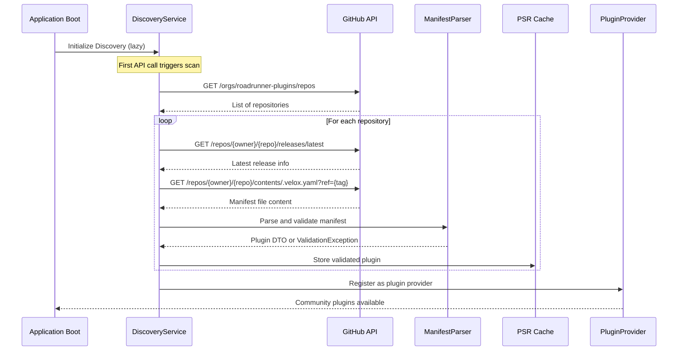
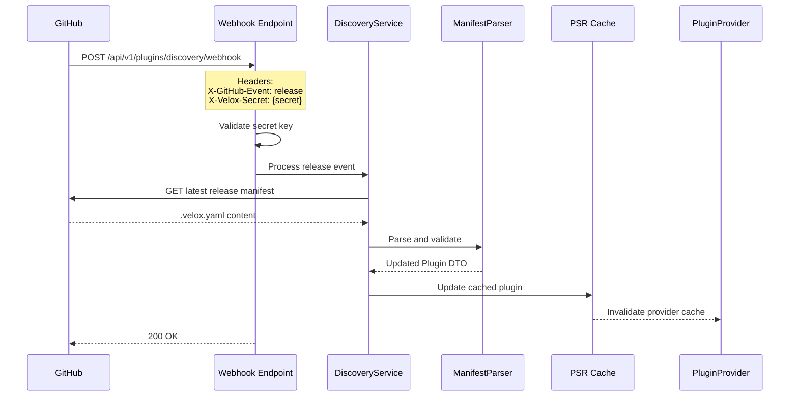

# Feature Request: Community Plugin Auto-Discovery System

## Overview

Implement an automatic discovery system for community-contributed RoadRunner plugins hosted in the `roadrunner-plugins`
GitHub organization. The system will scan repositories, parse plugin manifests, and dynamically register plugins for use
in Velox configuration builder.

## Business Value

- **Community Growth**: Enable community to contribute plugins without manual registration
- **Discoverability**: Automatic plugin catalog updates when new plugins are released
- **Reduced Maintenance**: Eliminate manual plugin registration in codebase
- **Flexibility**: Allow community plugins to override official plugins when needed
- **Real-time Updates**: Webhook integration for instant plugin availability

## Technical Requirements

### 1. Plugin Manifest File (`.velox.yaml`)

Each community plugin repository must contain a `.velox.yaml` file at the root with the following schema:

#### Required Fields

```yaml
name: redis-cache               # Unique plugin identifier (lowercase, alphanumeric with hyphens)
version: v1.2.0                # Semantic version from GitHub releases
owner: roadrunner-plugins      # GitHub organization or username
repository: redis-cache        # Repository name
description: "Redis-based caching plugin for RoadRunner with TTL support"
category: kv                   # Plugin category (enum)
dependencies: # List of required plugin names
  - logger
  - kv
  - redis
```

#### Optional Fields

```yaml
repositoryType: github         # Default: github (future: gitlab support)
folder: null                   # Subfolder path if plugin is not at repo root
replace: null                  # Go module replacement directive
docsUrl: https://github.com/roadrunner-plugins/redis-cache
author: # Author information
  name: John Doe
  email: john@example.com
  url: https://github.com/johndoe
license: MIT                   # SPDX license identifier
keywords: # Search keywords
  - cache
  - redis
  - performance
```

#### Available Categories

- `core` - Core functionality
- `logging` - Logging plugins
- `http` - HTTP server and middleware
- `jobs` - Job queue systems
- `kv` - Key-value storage
- `metrics` - Metrics and monitoring
- `grpc` - gRPC server
- `monitoring` - Health checks and status
- `network` - Network protocols (TCP, etc.)
- `broadcasting` - WebSocket/broadcasting
- `workflow` - Workflow engines
- `observability` - Tracing and observability

### 2. Discovery Service Architecture

```
Module/Velox/Plugin/Discovery/
├── DTO/
│   ├── PluginManifest.php          # Parsed .velox.yaml structure
│   ├── DiscoveryResult.php         # Result of discovery scan
│   └── DiscoveryStatistics.php     # Statistics (found, updated, failed)
│
├── Service/
│   ├── GitHubDiscoveryService.php  # Main orchestrator
│   ├── ManifestParserService.php   # YAML parser and validator
│   └── PluginRegistryService.php   # Registration and storage
│
├── Repository/
│   ├── DiscoveredPluginRepositoryInterface.php
│   └── CachePluginRepository.php   # PSR-16 SimpleCache implementation
│
├── Endpoint/
│   ├── Console/
│   │   └── DiscoverPluginsCommand.php
│   └── Http/v1/Discovery/
│       ├── WebhookAction.php       # GitHub webhook receiver
│       └── ListDiscoveredAction.php
│
├── Exception/
│   ├── ManifestValidationException.php
│   └── DiscoveryException.php
│
└── DiscoveryBootloader.php
```

### 3. Discovery Process Flow

#### Initial Discovery (Application Bootstrap)



#### Webhook Update Flow



### 4. Storage Strategy

**Implementation**: PSR-16 SimpleCache Interface

```php
interface DiscoveredPluginRepositoryInterface
{
    /**
     * Find all discovered plugins
     * @return array<Plugin>
     */
    public function findAll(): array;

    /**
     * Find plugin by name
     */
    public function findByName(string $name): ?Plugin;

    /**
     * Store or update plugin
     */
    public function save(Plugin $plugin): void;

    /**
     * Remove plugin
     */
    public function remove(string $name): void;

    /**
     * Get discovery metadata
     */
    public function getMetadata(): DiscoveryStatistics;
}

class CachePluginRepository implements DiscoveredPluginRepositoryInterface
{
    public function __construct(
        private CacheInterface $cache, // PSR-16
        private int $ttl = 3600,
    ) {}
}
```

**Cache Keys**:

- `velox.discovery.plugins` - Array of all plugins
- `velox.discovery.plugin.{name}` - Individual plugin
- `velox.discovery.metadata` - Statistics and last scan time

**Configuration**:

```php
// Developers configure cache adapter in application
'cache' => [
    'velox-discovery' => [
        'driver' => env('VELOX_CACHE_DRIVER', 'array'), // array, file, redis
        'ttl' => 3600,
    ],
],
```

### 5. Plugin Provider Integration

**New Provider**: `GitHubDiscoveryPluginProvider`

```php
class GitHubDiscoveryPluginProvider implements PluginProviderInterface
{
    public function __construct(
        private DiscoveredPluginRepositoryInterface $repository,
    ) {}

    public function getAllPlugins(): array
    {
        return $this->repository->findAll();
    }

    public function getPluginByName(string $name): ?Plugin
    {
        return $this->repository->findByName($name);
    }
    
    // ... implement other interface methods
}
```

**Integration with Composite Provider** (Priority System):

```php
// In PluginsBootloader
public function defineSingletons(): array
{
    return [
        PluginProviderInterface::class => fn(
            ConfigPluginProvider $configProvider,
            GitHubDiscoveryPluginProvider $discoveryProvider,
        ) => new CompositePluginProvider(
            providers: [
                $discoveryProvider,    // Priority 1: Community plugins
                $configProvider,       // Priority 2: Official plugins
            ],
        ),
    ];
}
```

**Override Behavior**: Community plugins with matching names override official plugins.

### 6. GitHub API Integration

**Reuse Existing**: `App\Module\Github\Client`

**Required API Calls**:

1. **List Organization Repositories**
   ```
   GET /orgs/roadrunner-plugins/repos
   ```

2. **Get Latest Release**
   ```
   GET /repos/{owner}/{repo}/releases/latest
   ```

3. **Get File Content**
   ```
   GET /repos/{owner}/{repo}/contents/.velox.yaml?ref={tag_name}
   ```

**Authentication**: Use existing GitHub token from environment (`GITHUB_TOKEN`)

**Rate Limiting**:

- Authenticated: 5,000 requests/hour
- Implement exponential backoff on rate limit errors
- Cache results to minimize API calls

### 7. Webhook Configuration

**Endpoint**: `POST /api/v1/plugins/discovery/webhook`

**Request Headers**:

```
X-GitHub-Event: release
X-Velox-Secret: {secret_from_config}
Content-Type: application/json
```

**Request Body** (GitHub release event):

```json
{
  "action": "published",
  "release": {
    "tag_name": "v1.2.0",
    "name": "Version 1.2.0",
    "draft": false,
    "prerelease": false
  },
  "repository": {
    "name": "redis-cache",
    "full_name": "roadrunner-plugins/redis-cache",
    "owner": {
      "login": "roadrunner-plugins"
    }
  }
}
```

**Security**:

- Simple secret key validation (no GitHub signature verification)
- Secret stored in environment: `VELOX_WEBHOOK_SECRET`
- Return 401 Unauthorized if secret mismatch

**Response**:

```json
{
  "status": "success",
  "plugin": {
    "name": "redis-cache",
    "version": "v1.2.0",
    "updated": true
  }
}
```

**GitHub Webhook Setup** (Manual Configuration):

1. Go to `https://github.com/organizations/roadrunner-plugins/settings/hooks`
2. Add webhook URL: `https://your-domain.com/api/v1/plugins/discovery/webhook`
3. Content type: `application/json`
4. Secret: Value from `VELOX_WEBHOOK_SECRET`
5. Events: Select "Releases" only
6. Active: ✓

### 8. CLI Commands

#### Discover Plugins Command

```bash
php app.php velox:discover-plugins

# Options:
--force           # Force re-scan even if cache is valid
--organization    # Override default organization
--clear-cache     # Clear existing cache before scan
```

**Output Example**:

```
Discovering community plugins from roadrunner-plugins...

✓ Found 12 repositories
✓ Scanned 12 manifests
✓ Registered 10 plugins
✗ Failed 2 plugins

Registered Plugins:
  - redis-cache (v1.2.0)
  - http-rate-limiter (v2.0.1)
  - azure-queue-driver (v1.0.0)
  ...

Failed Plugins:
  - invalid-plugin: Missing required field 'description'
  - broken-manifest: Invalid YAML syntax

Duration: 3.45s
```

### 9. HTTP Endpoints

#### List Discovered Plugins

```
GET /api/v1/plugins/discovered
```

**Response**:

```json
{
  "data": [
    {
      "name": "redis-cache",
      "version": "v1.2.0",
      "owner": "roadrunner-plugins",
      "repository": "redis-cache",
      "source": "community",
      "category": "kv",
      "description": "Redis-based caching plugin",
      "dependencies": [
        "logger",
        "kv",
        "redis"
      ],
      "docs_url": "https://github.com/roadrunner-plugins/redis-cache",
      "author": {
        "name": "John Doe",
        "email": "john@example.com"
      },
      "license": "MIT",
      "keywords": [
        "cache",
        "redis"
      ]
    }
  ],
  "meta": {
    "total": 10,
    "last_scan": "2025-01-15T10:30:00Z",
    "scan_duration_ms": 3450
  }
}
```

#### Trigger Manual Scan

```
POST /api/v1/plugins/discovery/scan
Headers:
  Authorization: Bearer {api_token}
```

**Response**:

```json
{
  "status": "success",
  "statistics": {
    "repositories_scanned": 12,
    "plugins_registered": 10,
    "plugins_failed": 2,
    "duration_ms": 3450
  }
}
```

### 10. Validation Rules

**Manifest Validation**:

1. **Name**:
    - Required, unique
    - Pattern: `^[a-z0-9-]+$` (lowercase alphanumeric with hyphens)
    - Length: 3-50 characters

2. **Version**:
    - Required
    - Must match existing GitHub release tag
    - Pattern: `^v\d+\.\d+\.\d+$` (semantic versioning)

3. **Description**:
    - Required
    - Length: 10-500 characters

4. **Category**:
    - Required
    - Must be one of predefined enum values

5. **Dependencies**:
    - Optional
    - Must be array of strings
    - Each dependency must reference existing plugin name

6. **Repository Info**:
    - `owner` and `repository` must match actual GitHub repo

**Error Handling**:

- Invalid manifests throw `ManifestValidationException`
- Exceptions are logged and sent to Sentry
- Failed plugins are skipped, scan continues
- Validation errors included in scan statistics

### 11. Configuration

**File**: `app/config/velox.php`

```php
return [
    'discovery' => [
        // Enable/disable discovery system
        'enabled' => env('VELOX_DISCOVERY_ENABLED', true),
        
        // GitHub organization to scan
        'organization' => env('VELOX_GITHUB_ORG', 'roadrunner-plugins'),
        
        // Manifest filename
        'manifest_file' => '.velox.yaml',
        
        // Cache TTL in seconds
        'cache_ttl' => (int) env('VELOX_CACHE_TTL', 3600),
        
        // Lazy loading (scan on first API call, not on boot)
        'lazy_load' => env('VELOX_LAZY_LOAD', true),
        
        // Webhook secret for authentication
        'webhook_secret' => env('VELOX_WEBHOOK_SECRET'),
        
        // Only plugins with GitHub releases (no master/branch support)
        'releases_only' => true,
        
        // GitHub API client configuration
        'github' => [
            'token' => env('GITHUB_TOKEN'),
            'timeout' => 30,
            'retry_attempts' => 3,
        ],
    ],
];
```

### 12. Error Handling and Logging

**Exception Hierarchy**:

```
DiscoveryException (base)
├── ManifestValidationException
│   ├── MissingRequiredFieldException
│   ├── InvalidFormatException
│   └── InvalidDependencyException
├── GitHubApiException
│   ├── RateLimitException
│   ├── RepositoryNotFoundException
│   └── ReleaseNotFoundException
└── CacheException
```

**Logging Strategy**:

```php
// Info level - successful operations
$logger->info('Plugin discovery completed', [
    'plugins_registered' => 10,
    'duration_ms' => 3450,
]);

// Warning level - validation failures
$logger->warning('Invalid plugin manifest', [
    'repository' => 'invalid-plugin',
    'error' => 'Missing required field: description',
]);

// Error level - critical failures
$logger->error('GitHub API error', [
    'repository' => 'redis-cache',
    'error' => 'Rate limit exceeded',
    'retry_after' => 3600,
]);
```

**Sentry Integration**:

- All `ManifestValidationException` sent to Sentry
- Include repository context in error reports
- Tag errors with `component:plugin-discovery`

## Dependencies

**External**:

- GitHub API v3
- PSR-16 SimpleCache implementation
- YAML parser (symfony/yaml)

**Internal**:

- `App\Module\Github\Client` (existing)
- `App\Module\Velox\Plugin\DTO\Plugin` (existing)
- `App\Module\Velox\Plugin\Service\PluginProviderInterface` (existing)
